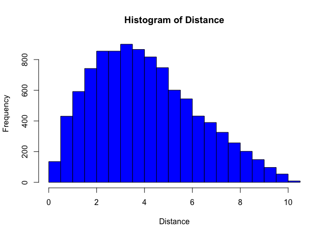

DistanceFinder
================
Paul M
1/27/2020

## The Distance Finder Problem

Here’s the code for our problem. First create some global variables to
dictate the parameters of the problem

``` r
# How many simulations to run?
NumberOfSims <- 10000

# What is the size of the grid?
a <- 10
b <- 5

set.seed(123)  # set the seed for the random number generator - this makes sure the results are reproducible when we are debugging

# Declare a vector variable to keep track of the sum of the distances across all simulations
Distance <- rep(0,NumberOfSims)  # For now, we fill it with 0s
```

Now simulate the process of choosing points randomly within the grid.

``` r
for (i in 1:NumberOfSims){
  # generate z1 (so generate it's x and y coordinates)
  z1 <- cbind(runif(1,0,a),runif(1,0,b))
  # generate z2 (likewise)
  z2 <- cbind(runif(1,0,a),runif(1,0,b))

  # Use Pythagoras' theorem to find the distance between them
  dist <- sqrt( (z1[1]-z2[1])^2 + (z1[2]-z2[2])^2)

  # Add the distance to the variable Distance
  Distance[i] <- dist
}
```

So let’s see what happened. We’ll calculate the average distance and
look at the distribution of the distance across all simulations

``` r
cat("\nOur estimate of the expected distance between the two points is ",mean(Distance))
```

    ## 
    ## Our estimate of the expected distance between the two points is  4.031342

``` r
hist(Distance,breaks=25,col="blue")
```

<!-- -->

As far as I am aware, this distribution is not one of the common
distributions.

It turns out that there is a theoretical answer to this problem. The
expected distance is
\[ E(d)=\frac{1}{15} \left[  \frac{a^3}{b^2} + \frac{b^3}{a^2} + \sqrt{a^2+b^2} \left( 3 - \frac{a^2}{b^2} - \frac{b^2}{a^2} \right) \right] + \frac{1}{6} \left[ \frac{b^2}{a} arccosh \left( \frac{\sqrt{a^2 + b^2}}{b} \right) +  \frac{a^2}{b} arccosh \left( \frac{\sqrt{a^2 + b^2}}{a} \right)  \right]  \]
where \[ arccosh(t)=log(t+\sqrt{t^2-1})\]. \[In order to get all that
Latex to knit to pdf, I had to install Tinytex via
“tinytex::install\_tinytex()”\]

Let’s evaluate that point and mark it on the histogram.

``` r
# first let's work out the arccosh terms
arg1 <- sqrt(a^2 + b^2) / b
arg2 <- sqrt(a^2 + b^2) / a

# Now for the expected distance
FirstArccosh <- log10( arg1 + sqrt(arg1^2-1) ) 
SecondArccosh <- log10( arg2 + sqrt(arg2^2-1) ) 
Expectation <- (1/15) * ( (a^3/b^2) + (b^3/a^2) + sqrt(a^2 + b^2) * (3 - (a^2/b^2) - (b^2/a^2) ) ) + (1/6) * (  (b^2/a) * FirstArccosh + (a^2/b) * SecondArccosh )

# and redo the plot
hist(Distance,breaks=25,col="blue")
abline(v=Expectation, lty=2, col="red", lwd=3, main="Distribution of distance, with expectation marked by red line")
```

<!-- -->
